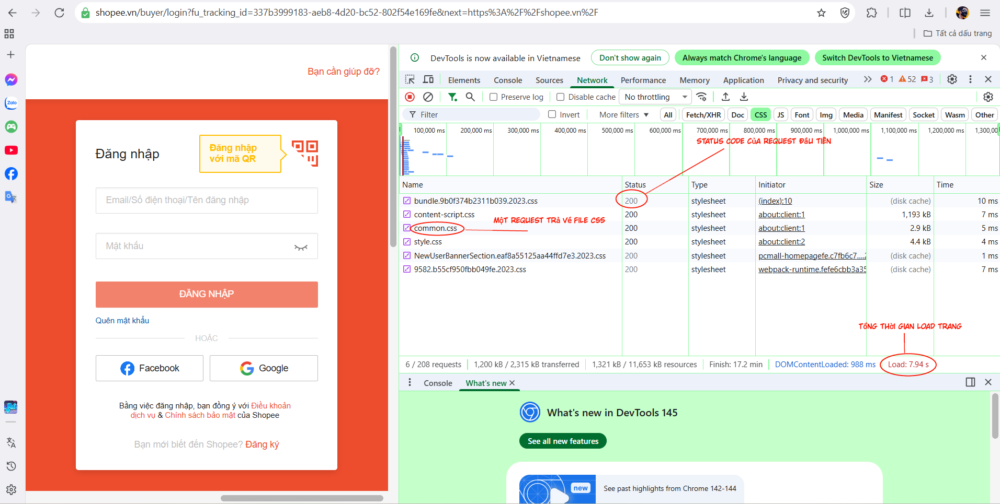
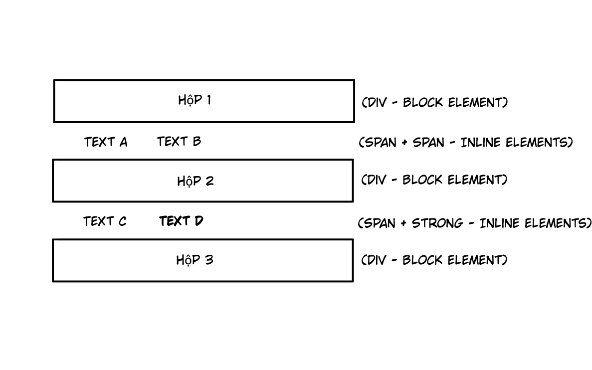
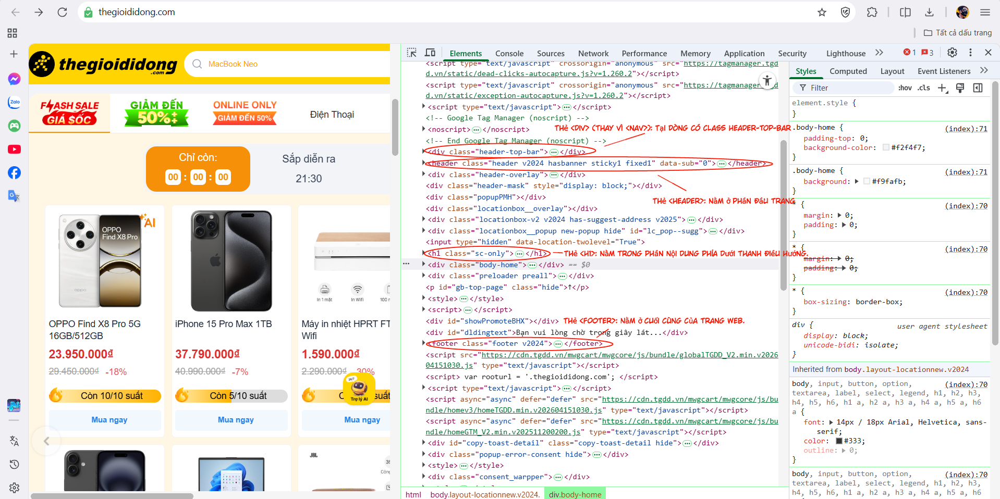
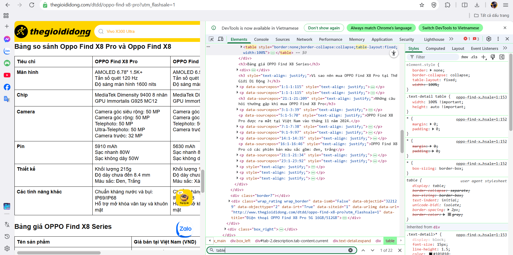
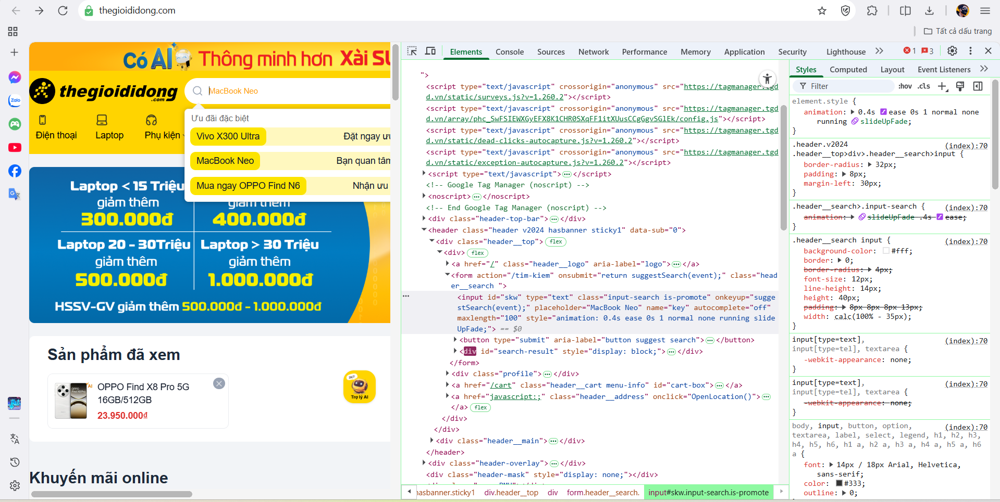

PHẦN A — KIỂM TRA ĐỌC HIỂU
Câu A1 — HTTP & Browser

1. Liệt kê đúng thứ tự 5 bước xảy ra khi truy cập https://shopee.vn:

Bước 1 (Gửi Request): Người dùng nhập URL và nhấn Enter, trình duyệt (Client) gửi một HTTP Request xuất phát từ máy tính, qua router, nhà mạng và cáp quang để đến Server.

Bước 2 (DNS Lookup): (Dựa theo logic thực tế trong hành trình 0.3s) Hệ thống tìm kiếm địa chỉ IP của server Shopee (trong tài liệu mô tả là "đến data center").

Bước 3 (Server xử lý): Server nhận request, xử lý logic (như kiểm tra xem Minh muốn xem gì) và chuẩn bị dữ liệu.

Bước 4 (Gửi Response): Server gửi ngược dữ liệu lại cho trình duyệt thông qua HTTP Response (thường chứa file HTML, CSS, JS).

Bước 5 (Rendering): Trình duyệt nhận file và thực hiện quy trình: Parse HTML (đọc bản vẽ) → Parse CSS (thiết kế nội thất) → Execute JS (lắp hệ thống điện) → Paint & Render (hiện trang web).

2. Thông tin trong tab Network:

Tab Network cho thấy các requests/responses. Nó giúp lập trình viên biết website tải những tài nguyên nào (HTML, ảnh, CSS, JS), file nào nặng nhất và tốc độ tải trang.

Câu A2 — Semantic HTML

1. Tại sao SEO thấp?

Trang web bị lỗi "Div Soup" (dùng 
 cho mọi thứ). Google không hiểu được cấu trúc nội dung, vai trò của từng phần, dẫn đến đánh giá thấp.

2. 4 lỗi Semantic và cách sửa:

Header: Dùng 
 → Sửa: <header> (Xác định phần đầu trang).

Menu: Dùng 
 → Sửa: <nav> (Chỉ rõ khu vực điều hướng).

Nội dung chính: Dùng 
 → Sửa: <main> (Xác định vùng chứa nội dung cốt lõi).

Sản phẩm: Dùng 
 → Sửa: <article> (Dùng cho bài viết/sản phẩm độc lập).

3. Code sửa lại:

<header>
    
ShopTLU

    <nav>
        <a href="/">Trang chủ</a> | <a href="/products">Sản phẩm</a>
    </nav>
</header>
<main>
    <article>
        <h3>iPhone 16 Pro</h3>
        
25.990.000đ

        
    </article>
</main>
<footer>© 2026 ShopTLU</footer>

Câu A3 — Block vs Inline

Giải thích tại sao:

 (Block-level element): Thẻ 
 mặc định chiếm toàn bộ chiều ngang của container và luôn bắt đầu trên một dòng mới. Do đó, "Hộp 1", "Hộp 2" và "Hộp 3" nằm trên các dòng riêng biệt.

 và <strong> (Inline-level element): Các thẻ này chỉ chiếm diện tích vừa đủ nội dung và không bắt đầu dòng mới. Vì vậy, "Text A" và "Text B" hiển thị trên cùng một hàng; "Text C" và "Text D" cũng hiển thị trên cùng một hàng.

Câu A4 — Table

1. Phân biệt <thead>, <tbody>, <tfoot>

<thead> (Header): Chứa tiêu đề các cột (thường dùng <th>), giúp định danh dữ liệu.

<tbody> (Body): Chứa dữ liệu chính của bảng.

<tfoot> (Footer): Chứa thông tin tổng kết, cộng dồn (thường dùng colspan để gộp ô).

2. Tại sao KHÔNG dùng Table để làm layout?

Dùng Table để dàn trang là kỹ thuật cũ, hiện tại không nên dùng vì:

Sai Semantic: Table chỉ dành cho dữ liệu thống kê, không phải để chia cột trang web.

Khó Responsive: Table rất khó co giãn trên màn hình điện thoại (Mobile).

Code rối: Cấu trúc thẻ lồng nhau quá nhiều (tr, td) gây khó bảo trì so với CSS Flexbox/Grid.

Bài B3 — Debug HTML

Lỗi 1: Dòng 1 — Thiếu giá trị html trong thẻ khai báo — Sửa thành <!DOCTYPE html>.

Lỗi 2: Dòng 2 — Thiếu thuộc tính lang cho thẻ mở — Sửa thành <html lang="vi">.

Lỗi 3: Dòng 3 — Thẻ <title> chưa đóng — Sửa thành <title>Trang web</title>.

Lỗi 4: Dòng 4 — Giá trị charset sai — Sửa thành và bổ sung thêm <meta charset="UTF-8">, <meta name="viewport" content="width=device-width, initial-scale=1.0">.

Lỗi 5: Dòng 5 — Thẻ kết thúc <h1> viết thiếu dấu gạch chéo — Sửa thành </h1>.

Lỗi 6: Dòng 10 — Thẻ <a> kết thúc sai — Sửa thành </a>.

Lỗi 7: Dòng 17 — Thẻ  thiếu dấu ngoặc kép cho thuộc tính và thiếu thuộc tính alt bắt buộc — Sửa thành .

Lỗi 8: Dòng 19 — Lồng thẻ sai (lộn thẻ đóng trước và sau) — Sửa thành 
Giá: <b>25.990.000đ</b>
.

Lỗi 9: Dòng 25 — Bảng dữ liệu thiếu thẻ cấu trúc <thead> và <tbody> — Sửa bằng cách bao bọc các hàng tương ứng.

Lỗi 10: Dòng 34 — Dùng thẻ <main> tới lần thứ hai  — Sửa thành thẻ <aside>.

Lỗi 11: Dòng 38 — Thẻ 
 chưa đóng — Sửa thành 
Copyright 2026
.

Bài B4 — Phân tích trang web thật

1. Chụp screenshot tab Elements: 

2. Phân tích Table:

Table hiển thị nội dung: Bảng so sánh thông số kỹ thuật (Màn hình, Chip, Camera, Pin...) giữa Oppo Find X8 Pro và Oppo Find X8.

Có dùng <thead>, <tbody>: Có. Trang web sử dụng cấu trúc bảng chuẩn: <thead> cho hàng tiêu đề tên sản phẩm và <tbody> cho danh sách các hàng thông số bên dưới.

3. Phân tích thẻ <form> tìm kiếm:

Action và Method:

- Action: /tim-kiem (Dữ liệu sẽ được gửi đến trang xử lý tìm kiếm của hệ thống).

- Method: GET (Từ khóa tìm kiếm sẽ hiển thị trực tiếp trên thanh địa chỉ URL của trình duyệt).

Các Input types được dùng:

- type="text": Ô nhập liệu chính (có id="skw") để người dùng gõ từ khóa tìm kiếm.

- button type="submit": Nút bấm (biểu tượng kính lúp) để kích hoạt lệnh gửi form đi.